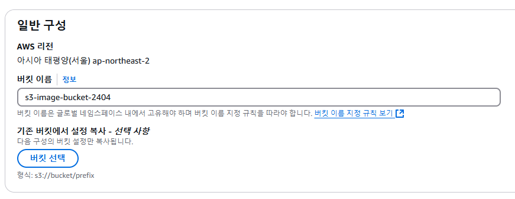
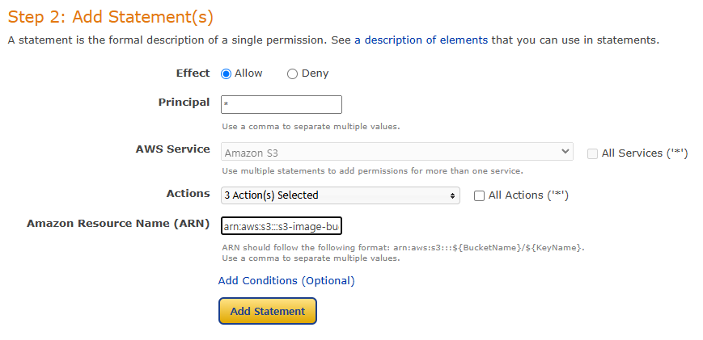
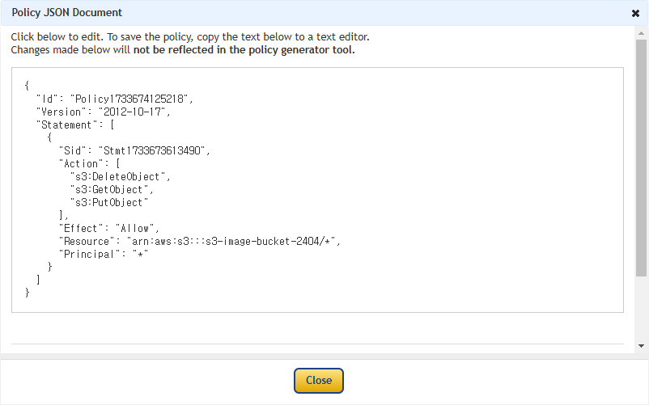
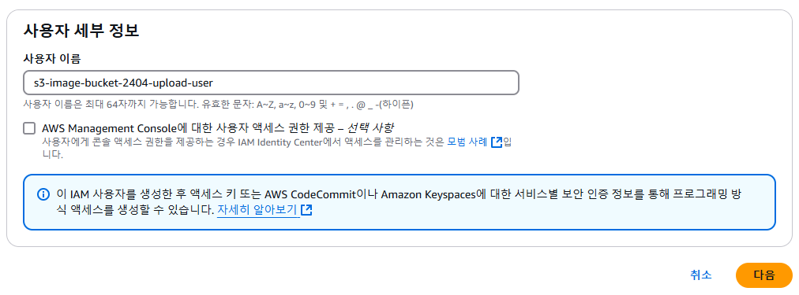
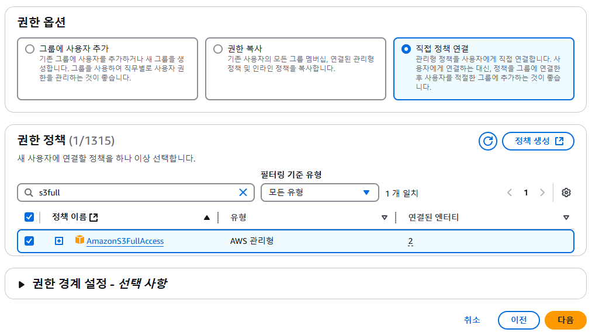
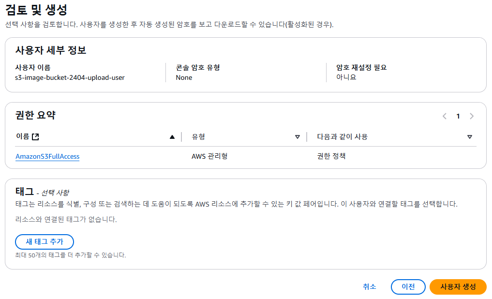
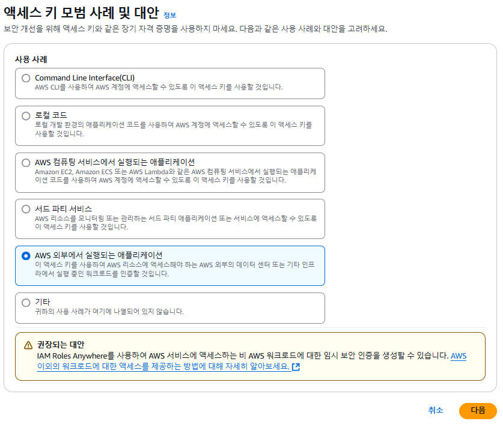
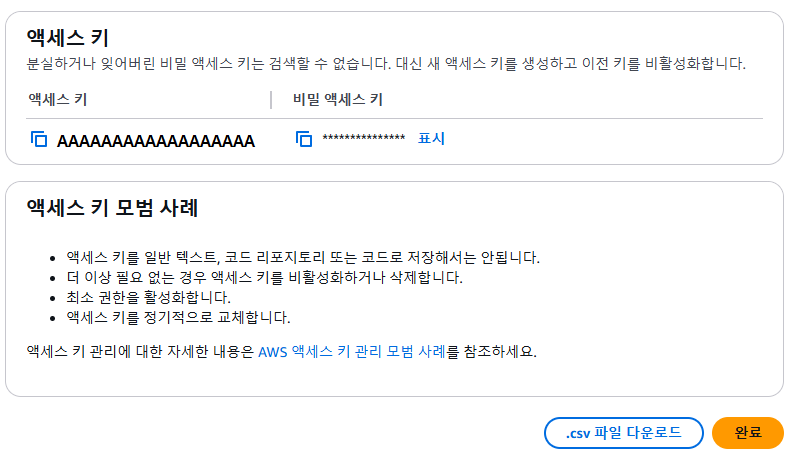

# S3

- S3(Amazon Simple Storage Service)는 **Amazon Web Services**에서 제공하는 클라우드 기반 **객체 스토리지 서비스**다.
- S3는 대규모 데이터 저장과 관리를 위해서 설계되었으며, 인터넷을 통해 접근 가능한 서비스로 파일 저장, 백업, 데이터 아카이빙, 빅 데이터 분석 등의 다양한 용도로 사용한다.

## 버킷(Bucket)

### 버킷이란 무엇인가?

- Amazon S3에 데이터(사진, 동영상, 문서 등)를 업로드하려면 우선 하나의 AWS 리전에 S3 버킷을 만들어야 한다.
- 버킷은 Amazon S3에 저장된 객체에 대한 컨테이너다.
- 버킷에 저장할 수 있는 객체 수에는 제한이 없다.
- 계정에 버킷을 최대 100개까지 포함할 수 있다.

### 버킷의 특징

- 를로벌 유일한 이름
  - 버킷의 이름은 **전 세계적으로 고유**해야 한다.
  - 버킷 이름은 DNS 규칙을 따라야 한다.
  - 한 번 생성한 버킷 이름은 다른 AWS 사용자와 공유할 수 없다.
- 리전 기반 생성
  - 버킷은 특정 **리전**에 생성된다.
  - 테이터는 해당 리전에 저장되면, 버킷에 접근할 때 리전을 고려해야 한다.
- 무제한 용량
  - 하나의 버킷에 저장할 수 있는 **데이터의 크기는 제한이 없다.**
  - 버킷에 저장되는 객체의 최대 크기는 **5TB**다.
- 계층적 구조가 아닌 평면 구조
  - S3버킷은 **평면 구조**를 가진다.
  - 디렉토리나 폴더가 없지만, 이름에 슬래시```/```를 사용해서 ```폴더처러 보이게``` 만들 수 있다.

### 버킷 이름 생성 규칙

- **3 ~63**글자 길이여야 한다.
- 소문자, 숫자, 하이픈(```-```)만 사용할 수 있다.
- 이름은 소문자 또는 숫자로 시작하고 끝나야 한다.
- 연속된 마침표나 하이픈으로 시작하거나 끝낼 수 엇다.
- IP 주소 형식과 유사하면 안된다.

## S3 인프라 구성하기

### S3 버킷 생성하기

1. AWS 서비스 중에서 S3를 선택한다.

2. 버킷 생성 화면에서 ```버킷 만들기```버튼을 클릭한다.
   

3. "버킷 만들기" 화면에
   1. 버킷이름을 입력한다.
        

   2. "객체 소유권"항목에서 "ACL 비활성화(권장)"을 선택한다.

   3. "이 버킷의 퍼블릭 엑세스 차단 설정"항목에서 "모든 퍼블릭 엑세스 차단"을 체크해제 한다.
        

   4. 그 외의 나머지 설정은 기본값으로 그대로 유지하고, "버킷 만들기"버튼을 클릭해서 버킷을 생성한다.

4. 생성된 버킷을 확인한다.
   

### 버킷 접근 권한 설정하기

- S3 버킷에서 이미지를 다운로드하는 것은 모두가 가능하게 설정한다.
- S3 버킷에 이미지를 업로드하는 것은 백엔드 애플리케이션만 가능하게 설정한다.

#### 다운로드 권한 설정하기

1. 해당 버킷의 "권한" 탭을 선택한다.  
   

2. "버킷 정책"항목의 "정책 생성기"버튼을 클릭한다.
   

3. "AWS Policy Generator"화면의 "Add Statement(s)"에서 

   1. "Select Type of Policy"에서 ```S3 Bucket Policy```를 선택한다.
   

   2. "Add Stetement(s)"에서 Principal 입력필드의 값을 ```*```으로 설정한다. 

   3. "Add Stetement(s)"의 Actions 셀렉터에서 ```getObject```,```putObject```,```deleteObject``` 3개를 선택한다. 

   4. "Add Stetement(s)"의 Amazon Resource Name (ARN)의 입력필드의 값을 ```arn:aws:s3:::s3-image-bucket-2404/*```로 설정한다.

   5. "Add Stetement(s)"에서 "Add Statement" 버튼을 클릭하고, 아래의 설정 내용을 확인한다.
   
   

   6. "Generate Policy"에서 "Generate Policy"버튼을 클릭해서 생성된 구문을 확인하고 복사한다.
   

4. 정책 입력창에 복사한 내용을 붙여넣기 한다.
   

5. "변경 사항 저장"버튼을 클릭해서 변경 내용을 저장한다. 

#### 업로드 권한 설정하기

- 백엔드 애플리케이션만 업로드가 가능하도록 ```IAM```유저를 생성해서 해당 권한을 설정하고 엑세스 키를 발급받아서 S3에 접근하도록 한다.

1. IAM에서 "사용자" 메뉴를 선택한다.

2. "사용자"화면에서 "사용자 생성"버튼을 클릭한다.
   

3. "사용자 세부 정보"화면에서 사용자 이름을 입력하고 "다음"버튼을 클릭한다.
   

4. "권한 옵션"항목에서 "직접 정책 연결"을 선택하고, "권한 정책"항목의 입력 필드에 "s3full"을 입력한다. ```AmazonS3FullAccess```권한을 체크하고 "다음"버튼을 클릭한다.
   

5. "검토 및 생성"화면에서 사용자 권한을 확인하고 "사용자 생성"버튼을 클릭한다.
   

6. "사용자" 화면에서 생성한 IAM 사용자를 클릭한다.
   

7. "s3-image-bucket-2404-upload-user" IAM 사용자 화면의 "엑세스 키" 항목에서 "엑세스 키 만들기"버튼을 클릭한다.
   

8. "엑세스 키 모범 사례 및 대안"화면에서 "AWS 컴퓨팅 서비스에서 실행되는 애플리케이션" 혹은 "AWS 외부에서 실행되는 애플리케이션" 중 하나를 선택하고, "다음"버튼을 클릭한다.  
   

9. "설명 태그 설정"화면에서 적절한 설명 태그 값을 입력하고, "엑세스 키 만들기"버튼을 클릭한다.
   

10. "엑세스 키 검색"화면에서 생성된 "엑세스 키"와 "비밀 엑세스 키"를 확인하고, ".csv 파일 다운로드"버튼을 클릭해서 다운받는다.
   
