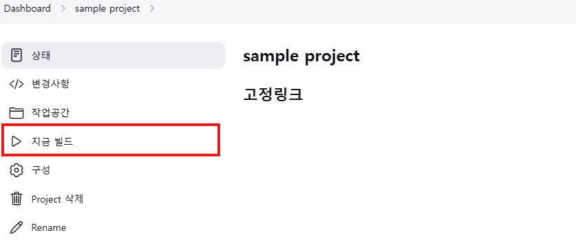
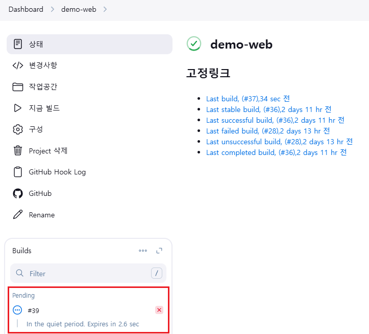
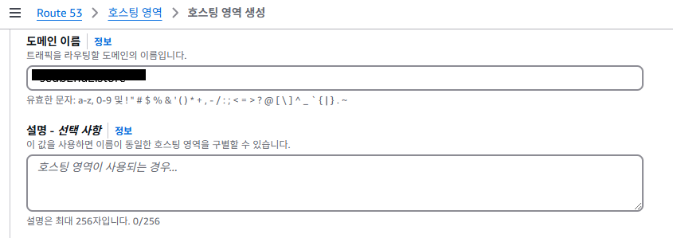
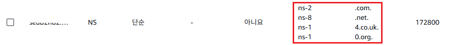
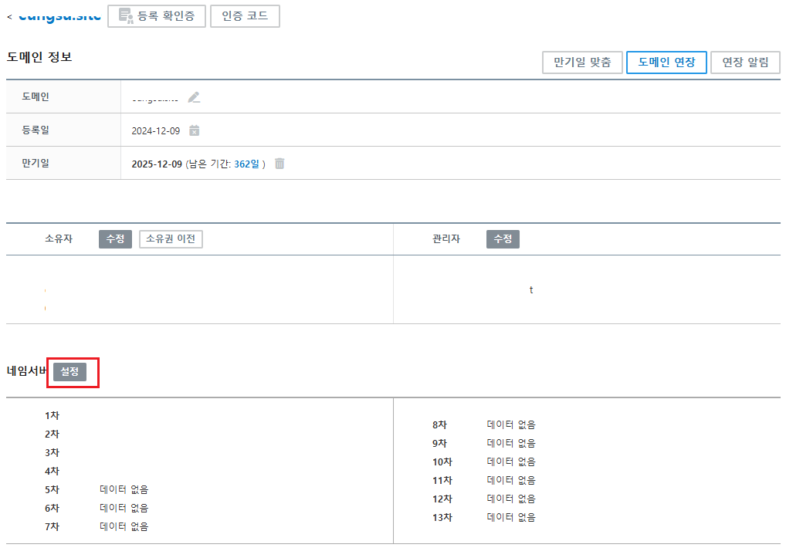
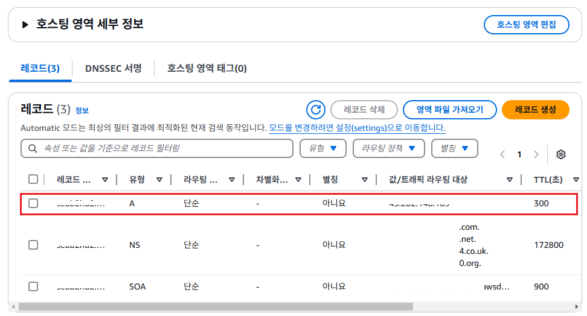

# AWS에 스프링 애플리케이션 배포

## EC2 인스턴스 생성하기

## EC2 인스턴스 자바 애플리케이션 실행 환경 구성하기

1. jdk 설치하기

    ```bash
    # 패키지 목록을 업데이트하고, 시스템을 업그레이드 한다.
    sudo apt update && sudo apt upgrade -y

    # jdk 21을 설치한다.
    sudo apt install openjdk-21-jdk -y

    # 설치된 자바 버전을 확인한다.
    java -version

    # 출력 예시
    # ubuntu@ip-10-0-0-108:~$ java -version
    # openjdk version "21.0.5" 2024-10-15
    # OpenJDK Runtime Environment (build 21.0.5+11-Ubuntu-1ubuntu124.04)
    # OpenJDK 64-Bit Server VM (build 21.0.5+11-Ubuntu-1ubuntu124.04, mixed mode, sharing)
    ```

2. git 설치하기

    ```bash
    # 패키지 목록을 업데이트 한다.
    sudo apt update

    # git을 설치한다.
    sudo apt install git -y 

    # 설치된 git 버전을 확인한다.
    git --version

    # git 사용자정보를 설정한다.
    git config --global user.name "이름"
    git config --global user.email "이메일주소"
    ```

3. 메모리 스왑 설정하기

    ```bash
    # 루트에 스왑 파일 생성
    sudo dd if=/dev/zero of=/swapfile bs=128M count=32

    # 스왑 파일의 권한 변경
    sudo chmod 600 /swapfile

    # 리눅스 스왑 영역 설정
    sudo mkswap /swapfile

    # 스왑 공간에 스왑 파일 추가
    sudo swapon /swapfile

    # 프로시저가 성공적인지 확인
    sudo swapon -s

    # /etc/fstab 파일을 편집하여 부팅 시 스왑 파일을 시작
    sudo vi /etc/fstab

    # /etc/fstab 파일의 마지막줄에 다음 라인 추가
    /swapfile swap swap defaults 0 0

    # 스왑 메모리가 할당된 것 확인
    free
    ```

## EC2 인스턴스에 젠킨스 실행환경 구성하기

1. git 설치하기

    ```bash
    # 패키지 목록을 업데이트 한다.
    sudo apt update

    # git을 설치한다.
    sudo apt install git -y 

    # 설치된 git 버전을 확인한다.
    git --version

    # git 사용자정보를 설정한다.
    git config --global user.name "이름"
    git config --global user.email "이메일주소"
    ```

2. 젠킨스 설치하기

    최신 버전의 Jenkins를 설치하기 위해 공식 Jenkins 레포지토리를 추가한다.

    ```bash
    # GPG 키를 추가한다.
    curl -fsSL https://pkg.jenkins.io/debian/jenkins.io-2023.key | sudo tee \
    /usr/share/keyrings/jenkins-keyring.asc > /dev/null

    # 레포지토리를 추가한다.
    echo "deb [signed-by=/usr/share/keyrings/jenkins-keyring.asc] \
    https://pkg.jenkins.io/debian binary/" | sudo tee \
    /etc/apt/sources.list.d/jenkins.list > /dev/null

    # 패키지 목록을 업데이트 한다.
    sudo apt update

    # 젠킨스를 설치한다.
    sudo apt install jenkins -y

    # 젠킨스 서비스를 시작시킨다.
    sudo systemctl start jenkins

    # 젠킨스가 시스템 부팅 시 자동으로 시작되도록 설정한다.
    sudo systemctl enable jenkins

    # 젠킨스 실행 상태를 확인한다.
    sudo systemctl status jenkins

    # 출력 예시
    # ● jenkins.service - Jenkins Continuous Integration Server
    #       Loaded: loaded (/usr/lib/systemd/system/jenkins.service; enabled; preset: enabled)
    #       Active: active (running) since Tue 2024-12-10 06:33:57 UTC; 52s ago
    #     Main PID: 10933 (java)
    #        Tasks: 39 (limit: 1130)
    #       Memory: 310.2M (peak: 406.0M)
    #          CPU: 16.628s
    #       CGroup: /system.slice/jenkins.service
    ```

3. 젠킨스에서 sudo 권한 사용 설정

    ```bash
    sudo visudo

    # sudoers 파일 내용의 마지막 줄에 아래 내용을 추가한다.
    jenkins ALL=(AlL)   NOPASSWD: ALL
    ```

4. 웹 브라우저에서 ```http://IP주소:8080```주소로 Jenkins에 접속한다.

5. 초기 관리자 비밀번호를 입력한다.

6. 초기 설정 마법사를 따라 플러그인 설치 및 관리자 계정 생성을 완료한다.


7. 추가로 Jenkins 플러그인 설치하기
    1. 젠킨스 홈화면의 좌측 메뉴에서 "Jenkins 관리"를 클릭한다.
    

    2. "Jenkins 관리" 화면에서 "Plugins"을 클릭한다.
    

    3. "Plugins" 화면에서 "Available plugins"을 선택한 다음 입력필드에 ```Post build task``` 플러그인을 검색해서 설치한다.
    

    4. "Download progress" 화면의 하단에 체크박스를 체크하면, 설치가 완료된 후 자동으로 젠킨스가 재시작된다.
    

## Jenkins와 Github 연동하기

1. [토크발행](https://github.com/settings/tokens) 접속해서 Github에서 Personal access tokens을 발행한다.
    1. "Generate new Token" 버튼을 클릭하고, "Generate new token(classic)"를 선택한다.
    

    2. 토큰 정보를 입력하고, "Select scopes" 항목에서 "repo", "workflow", "admin:repo_hook"을 체크한 다음
    아래의 "Generate token"버튼을 클릭한다.  
    

    3. 생성된 토큰을 복사한다.(토큰은 최초 생성할 때만 내용을 확인할 수 있다.)
    

2. 젠킨스에 github 계정 정보 등록하기
    1. 위에서 설치한 젠킨스에 접속하고, 이미 등록한 관리자 계정으로 로그인 한다.
    

    2. 메뉴에서 "Jenkins 관리"를 선택한다.

    3. "Jenkins 관리" 화면에서 "Credentials"을 선택한다.
    

    4. "Store sceoped to Jenkins"의 "global"를 클릭하고, "Add Credentials"을 선택한다.
    

    5. "New credentials"화면에서 아래의 정보를 입력하고 "Create"버튼을 클릭한다.
    

    6. 등록이 완료되면 아래 내용을 확인할 수 있다.
    

3. Jenkins 프로젝트 등록하기
    1. 젠킨스 홈 화면의 좌측 메뉴에서 "+ 새로운 Item" 메뉴를 클릭한다.  
    

    2. "새 프로젝트 등록" 화면에서 "프로젝트 이름"과 "프로젝트 타입"을 선택한다.
    

    3. "General"에서 "GitHub project"를 체크하고 "Project url"을 입력한다.
    

    4. "소스 코드 관리"에서 "Get"을 선택하고, "Repository URL"과 "Credentials"를 추가한다.
    

    5. "Build Steps"에서 "Execute shell"을 선택하고, 소스코드를 빌드하는 스크립트를 추가한다. "Save" 버튼을 클릭해서 프로젝트 설정정보를 저장한다.
    

    6. "프로젝트" 화면에서 "지금 빌드"버튼을 클릭해서, 프로젝트 빌드 과정이 실행되는 테스트 한다.
    

    7. 빌드가 성공하면 아래와 같이 표시된다.  
    

    8. 빌드번호를 클릭하면, 해당 빌드에 대한 자세한 정보를 확인할 수 있다.
    

    9. "Console Output"을 클릭하면, 빌드실행 과정을 확인할 수 있다.
    

## Github Web hook 설정하기

1. 해당 프로젝트의 "Settings" 버튼을 클릭한다.


2. "Settings"화면의 좌측 메뉴에서 "Webhooks" 메뉴를 선택한다.  


3. "Webhooks" 화면에서 "Add webhook" 버튼을 클릭한다.


4. "Webhooks" 등록화면에서 "Payload URL"과 "Content type"값을 설정한다.


5. "Webhooks" 등록화면에서 "Webhooks" 등록 후 젠킨스와 연결상태를 확인한다.


6. Jenkins 프로젝트 등록하기 (위에서 이미 생성한 프로젝트에서 아래의 내용을 추가한다.)  
   1. 젠킨스 홈 화면에서 "sample project"를 선택한다.
   

   2. 해당 프로젝트에서 "구성" 메뉴를 클릭한다.
   

   3. "Trigger"항목에서 "GitHub hook trigger for GITScm polling"를 체크한다.
   

   4. "빌드 후 조치 추가"버튼을 클릭하고, "Post build task"를 선택한다.
   

   5. "Post build task"의 각 입력필드에 아래의 내용을 입력한다.
   

        ```
        # Log text
        "BUILD SUCCESSFUL"을 입력한다.


        # Operation
        "-- AND --"를 선택한다


        # Script
        echo "-----------------------------------------------------"
        echo "실행 중인 스프링 웹 애플리케이션 종료 -- 시작"
        echo "-----------------------------------------------------"
        JAR_NAME=demo-web-1-0.0.1-SNAPSHOT.jar

        if [ -z "`ps -eaf | grep $JAR_NAME | grep -v grep`" ]; then
        echo "not found $JAR_NAME"
        else
        ps -eaf | grep $JAR_NAME | grep -v grep | awk '{print $2}' |
        while read PID
        do
            echo "Killing $PID ..."
            sudo kill -9 $PID
            echo "$PID is shutdown!"
        done
        fi

        echo "-----------------------------------------------------"
        echo "실행 중인 스프링 웹 애플리케이션 종료 -- 완료"
        echo "-----------------------------------------------------"
        ```

   6. 다시, 빌드 후 조치 추가"버튼을 클릭하고, "Post build task"를 선택한 다음 아래의 내용을 입력한다.
   

        ```
        # Log text
        "완료"을 입력한다.


        # Operation
        "-- AND --"를 선택한다
        

        # Script
        echo "---------------------------------"
        echo "웹 애플리케이션 배포 -- 시작"
        echo "----------------------------------"

        JAR_NAME=demo-web-1-0.0.1-SNAPSHOT.jar
        sudo nohup java -jar "/var/lib/jenkins/workspace/demo-web/build/libs/$JAR_NAME" /dev/null 2>&1 &

        echo "---------------------------------"
        echo "웹 애플리케이션 배포 -- 완료"
        echo "---------------------------------"
        ```
    7. Github에 소스코드를 Push 후, 젠킨스에서 해당 프로젝트가 빌드되는 것을 확인할 수 있다.
    

    8. 해당 프로젝트 빌드의 콘솔출력 내용을 확인할 수 있다.
     

    9. 스프링 부트 프로젝트가 EC2 서버에 정상적으로 배포되었는지 확인하자.

## EC2 인스턴스에 도메인 연결하기 (가비아 기준)

1. [가비아](https://www.gabia.com/)에서 도메인을 등록한다.

2. AWS의 "Route 53" 서비스에 접속한다.

3. "Route 53"의 메뉴에서 "호스팅 영역"을 선택한다.


4. "호스팅 영역" 화면에서 "호스팅 영역 생성"버튼을 클릭한다.


5. "호스팅 영역 생성" 화면에서 도메인 이름을 입력하고, "호스팅 영역 생성" 버튼을 클릭한다. 도메인 이름은 가비아에서 등록한 도메인 이름을 입력한다.


6. "호스팅 목록"에서 생성된 호스팅 영역을 확인한다.


7. "호스팅 목록"에서 생성된 호스팅을 클릭해서 "호스팅 영역 세부 정보" 화면으로 이동한다.


8. "호스팅 영역 세부 정보"의 레코드 중에서 아래의 정보를 복사한다.


9. 가비아에 접속 -> My가비아 -> 서비스 관리를 클릭한다.

10. 서비스 관리에서 등록된 도메인을 확인하고 "관리" 버튼을 클릭한다.


11. "도메인 정보" 조회 화면에서 네임서버 "설정"버튼을 클릭한다.


12. "네임서버"설정 화면의 각 입력필드에 8번 항목에서 복사한 값을 하나씩 입력한다. 입력할 때 주소 끝의 "."은 입력하지 않는다.


13. "호스팅 영역 세부 정보"에서 "레코드 생성"버튼을 레코드 생성 화면을 열고, 아래와 같이 정보를 입력하고, "레코드 생성"버튼을 클릭한다.


14. "호스팅 영역 세부 정보"의 레코드 목록에서 새로 추가된 레코드를 확인할 수 있다.


15. 도메인 연결 후 즉시 반영되지 않기 때문에, 1시간 혹은 2~3일 경과 후 도메인명으로 접속가능해 진다.
