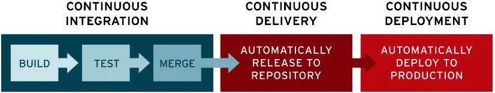

# CI/CD

## CI/CD란 무엇인가?

- CI/CD는 소프트웨어 개발 및 배포 과정을 자동화하고 효율적으로 만드는 접근 방식이다.
- **지속적 통합:Continuous Integration**과 **지속적 제공:Continuous Delivery 및 지속적 배포:Continuous Deployment**를 포함한다.
- 지속적 통합은 코드 변경 사항을 공유 소스 코드 리포지토리에 자동으로 자주 통합하는 것을 말한다.
- 지속적 제공 및 배포는 코드 변경 사항의 통합, 테스트, 제공을 나타내는 프로세스다. 지속적 제공에는 자동 프로덕션 배포 기능이 없는 반면, 지속적 배포는 업데이트를 프로덕션 환경에 자동으로 릴리스하는 것이다.
- 지속적 통합과 지속적 제공 및 배포를 연결해서 **CI/CD 파이프라인**이라고 부르며, 개발 팀과 운영 팅미 **DevOps**를 통해 애자일 방식으로 협력하여 이를 지원한다.

## CI/CD 중요성

- CI/CD는 조직이 버그 및 코드 오류를 예방하는 동시에 지속적인 소프트웨어 개발 및 업데이트 주기를 유지하는 데 도움이 된다.
- 애플리케이션이 커짐에 따라 CI/CD의 기능을 활용하면 복잡성을 줄이고 효율성을 높이며 워크플로우를 간소화할 수 있다.
- 기존에 새 코드를 커밋에서 프로덕션으로 가져오는 데 필요했던 수동 개입을 CI/CD가 자동화하므로 다운타임이 최소화되고 코드 릴리스 주기가 단축된다.
- 코드의 업데이트와 변경 사항을 더 빠르게 통합할 수 있으므로 사용자 피드백을 더 자주 효과적으로 통합할 수 있고, 그 결과 사용자에게 긍정적인 결과를 제공할 수 있으며 전체적인 고객 만족도가 향상된다.

## CI/CD의 주요 단계

### 지속적 통합

- 지속적 통합은 개발자가 애플리케이션에 적용한 변경 사항들이 병합된 후 변경 사항이 애플리케이션을 손상시키지 않도록 자동으로 애플리케이션을 빌드하고 다양한 수준으로 자동화된 테스트(일반적으로 단위테스트와 통합테스트)을 실행하여 해당 변경 사항을 검증하는 것이다.

### 지속적 제공

- 지속적 제공은 CI에서 빌드와 단위 및 통합 테스트를 자동화한 다음 검증된 코드를 레포지토리로 릴리스하는 것을 자동화한다.
- 지속적 제공은 개발자의 애플리케이션 변경 사항이 자동으로 버그 테스트를 거치고 레포지토리(GitHub, 컨테이너 레지스트리 등)로 업로드된다는 것을 의미한다.
- 지속적 제공이 종료되면 운영 팀은 애플케이션을 프로덕션 환경으로 신속하게 배포할 수 있다. 지속적 제공의 목표는 언제나 프로덕션 환경으로 배포할 준비가 되어 있는 코드베이스를 갖추고 새로운 코드를 배포하는 데 필요한 노력을 최소화하는 것이다.

### 지속적 배포

- 지속적 배포는 성숙한 CI/CD 파이프라인의 최종 단계다.
- 지속적 배포는 지속적 제공의 확장으로, 개발자의 변경 사항을 레포지토리에서 프로덕션으로 릴리스하는 것을 자동화하여 고객이 사용할 수 있도록 하는 것이다.
- 지속저 배포는 개발자가 애플리케이션에 변경 사항을 작성한 후 몇 분이내에 클라우드 애플리케이션을 자동으로 실행할 수 있는 것을 의미한다. 이를 통해 사용자 피드백을 지속적으로 수신하고 통합하는 일이 훨씬 수월해진다.

## CI/CD 도구

- CI/CD 도구는 팀이 개발, 배포, 테스트를 자동화하도록 지원하는 도구다.
- Jenkins
  - 가장 많이 사용되는 CI/CD 도구다.
  - Jenkins는 중앙 빌드 및 지속적인 통합 프로세스가 가능하며, Windows, macOS 및 기타 Unix 계열 운영 체제용 패키지가 포함된 독립형 Java 기반 프로그램이다.
  - 수백개의 플러그인을 사용할 수 있는 Jenkins는 소프트웨어 개발 프로젝트의 빌드 파이프라인 구성, Build 자동화의 확립, 배포 및 테스트 자동화 등을 지원한다.
- CircleCI
  - CircleCI는 코드 구축, 테스트에서 배포에 이르기까지 사용자의 파이프라인 전반에 걸쳐 신속한 소프트웨어 개발 및 게시를 지원하는 CI/CD 자동화 도구이다.
  - CircleCI를 GitHub, GitHub Enterprise 및 Bitbucket과 통합하여 사용할 수 있다는 장점이 있다.
- TeamCity
  - TeamCity는 JetBrains의 빌드 관리 및 지속적 통합 서버로써 Java 환경에서 실행되며 Visual Studio 및 IDE와 통합될수있는데, Windows 및 Linux 서버에 모두 설치할 수 있으며 .NET 및 개방형 스택 프로젝트도 지원한다.
