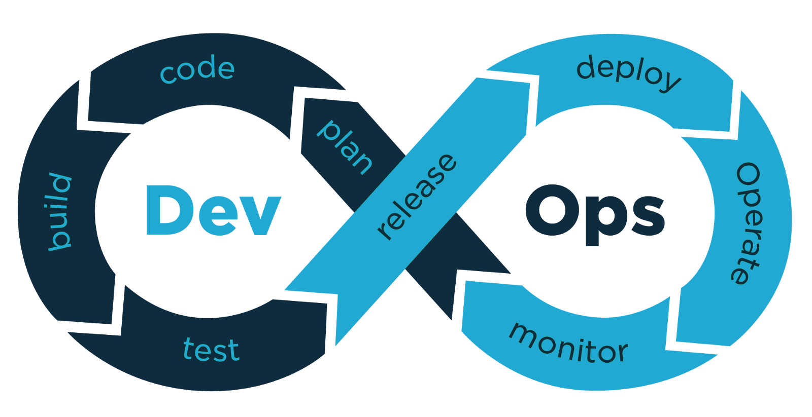

# DevOps

## DevOps란 무엇인가?

- DevOps는 소프트웨어 개발 및 IT 운영 팀의 작업을 결합하고 자동화하여 고품질 애플리케이션 및 서비스 제공을 가속화하는 소프트웨어 개발 방법론입니다.
- DevOps는 애플리케이션과 서비스를 빠른 속도로 제공할 수 있도록 조직의 역량을 향상시키는 문화 철학, 방식 및 도구의 조합이다.
- DevOps는 애플리케이션 개발 팀(Dev)과 해당 IT 운영 팀(Ops) 간의 원활하고 지속적인 커뮤니케이션, 협업, 통합, 가시성, 투명성을 지원합니다.
- 'Dev'와 'Ops' 간의 긴밀한 관계는 초기 소프트웨어 계획에서 코딩, 빌드, 테스트 및 릴리즈 단계와 배포, 운영, 지속적인 모니터링에 이르기까지 DevOps 라이프사이클의 모든 단계에 걸쳐 있습니다.

## DevOps 프로세스

- 계획(Plan)
  - 소프트웨어 개발 주기의 첫 번째 단계로, 팀이 요구사항을 정의하고 작업을 계획한다.
  - 목적 : 프로젝트의 방향성을 설정하고 요구사항을 명확히 정의한다.
  - 도구 : Jira, Trello, Asana 등 프로젝트 관리 도구
  - 핵심 활동
    - 사용자 요구사항 수집
    - 프로젝트 로드맵 생성
    - 작업 항목(Task) 분류 및 우선 순위 설정
- 개발(Develop)
  - 개발자는 코드를 작성하고 변경 사항을 관리한다.
  - 목적 : 기능을 구현하고 소스 코드를 관리한다.
  - 도구 : Git, GitHub, GitLab, Bitbucket
  - 핵심 활동
    - 코드 작성 및 검토
    - 코드 버전 관리
    - 유닛 테스트 작성
- 빌드(Build)
  - 소스 코드를 컴파일하고 실행 가능한 애플리케이션을 생성한다.
  - 목적 : 코드의 품질을 검증하고 오류 없는 빌드 생성한다.
  - 도구 :  Maven, Gradle, Jenkins, GitLab CI/CD
  - 핵심 활동
    - 컴파일 및 종속성 관리
    - 자동화된 테스트 실행
    - 빌드 아티팩트 생성
- 테스트(Test)
  - 애플리케이션의 품질을 보장하기 위해 테스트를 수행한다.
  - 목적 : 결함 및 오류를 발견하고 수정한다.
  - 도구 : Selenium, JUnit, TestNG, Cypress 등
  - 핵심 활동
    - 단위 테스트
    - 통합 테스트
    - 사용자 인터페이스(UI) 및 성능 테스트
- 릴리스(Release)
  - 테스트를 통과한 애플리케이션을 준비하여 배포한다.
  - 목적 : 안정적인 애플리케이션 배포를 준비한다.
  - 도구 : Jenkins, GitLab CI/CD 등
  - 핵심 활동
    - 배포 패키지 생성
    - 배포 승인 프로세스 수행
    - 환경별 구성 관리
- 배포(Deploy)
  - 애플리케이션을 프로덕션 환경에 배포한다.
  - 목적 : 사용자에게 애플리케이션을 제공한다.
  - 도구 : Kubernetes, Docker, Ansible, Terraform 등.
  - 핵심 활동
    - 무중단 배포(Blue-Green, Canary 배포)
    - 자동화된 배포 실행
    - 모니터링 구성
- 운영(Operate)
  - 배포된 애플리케이션을 운영하며 안정성과 성능을 보장한다.
  - 목적 : 시스템 가용성 유지 및 성능 최적화한다.
  - 도구 : Prometheus, Grafana, Datadog, New Relic 등.
  - 핵심 활동
    - 시스템 및 애플리케이션 모니터링
    - 로그 분석
    - 이슈 대응 및 해결
- 모니터링(Monitor)
  - 애플리케이션의 성능 및 안정성을 지속적으로 모니터링하여 피드백을 제공한다.
  - 목적 : 문제를 조기에 발견하고 서비스 품질 개선한다.
  - 도구 : Nagios, ELK Stack, Splunk 등.
  - 핵심 활동
    - 리소스 사용량 분석
    - 사용자 피드백 수집 및 분석

## DevOps의 장점

- 협업과 커뮤니케이션
  - 소프트웨어의 안정적인 개발을 위해  개발자과 운영팀은 서로의 작업 방식과 요구 사항을 이해하고, 이를 바탕으로 협력하여 문제를 해결하는 것이 핵심이다. DevOps를 도입함으로써 정기적인 회의와 피드백 세션을 통해 서로의 작업을 투명하게 공유할 수 있으며, 이로 인해 원활한 협업이 가능해진다.
- 지속적인 통합과 배포
  - 지속적인 통합(CI: Continuous Integration)은 코드 변경 사항을 자주 통합하여 문제를 조기에 발견하도록 하고, 지속적인 배포(CD: Continuous Deployment)는 자동화된 방식으로 소프트웨어를 신속히 사용자에게 제공하는 프로세스다.
  - DevOps의 CI/CD를 통해 배포 주기가 단축되고 품질이 향상되어, 시장 변화에 신속하게 대응할 수 있다.
- 자동화
  - DevOps는 반복적인 작업을 자동화하여 인적 오류를 최소화하고, 효율성을 극대화한다.
  - DevOps 엔지니어는 빌드, 테스트, 배포 과정을 자동화하여 팀의 생산성을 크게 향상시키며, Jenkins와 같은 CI/CD 도구를 사용하여 자동화된 파이프라인을 구축한다.
- 모니터링과 피드백
  - 시스템 성능과 사용자 피드백을 지속적으로 모니터링하여 개선점을 찾아내는 것입니다.  문제를 조기에 발견하고 해결할 수 있는 기회를 제공합니다. 이를 통해 운영팀은 시스템의 안정성을 유지하고, 개발자는 사용자 요구에 빠르게 대응할 수 있다.
  - DevOps는 프로젝트를 원할하게 운영하고 변화하는 상황에 빠르게 대응하여 언제나 최상의 품질로 서비스를 제공하기 위해 활용된다.
  