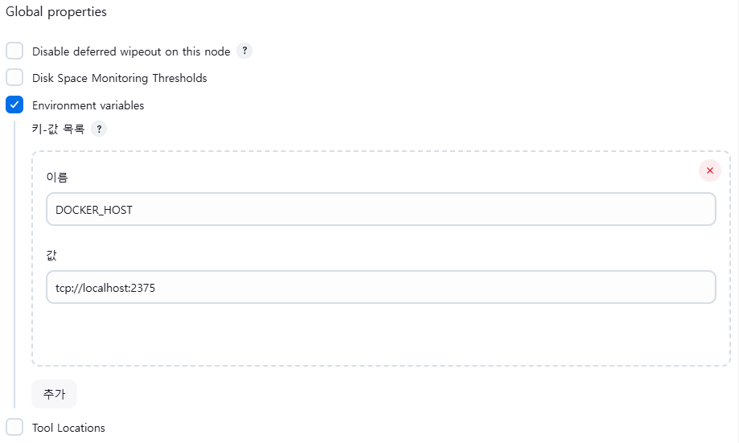
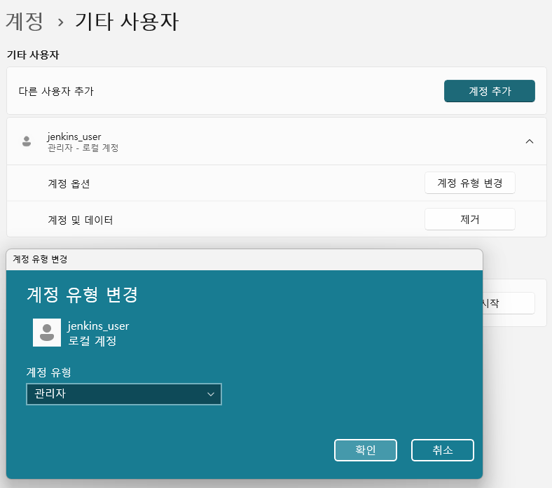
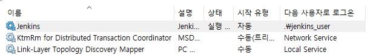

# Jenkins

## Jenkins란 무엇인가?

- Jenkins는 오픈 소스 자동화 서버다.
- Jenkins는 소프트웨어 개발 작업을 자동화하고 지속적 통합과 지속적 배포를 지원한다.
- 다양한 플러그인을 통해 빌드, 테스트, 배포, 모니터링 등을 효율적으로 처리할 수 있다.

## Jenkins의 특징

- 오픈 소스 및 무료
  - 누구나 무료로 사용할 수 있으며, 커뮤니티와 기업들이 지속적으로 기능을 확장하고 지원한다.
- 플러그인 기반
  - Jenkins는 1,800개 이상의 플러그인을 제공하며, 다양한 작업(코드 품질 분석, 컨테이너 관리, 클라우드 배포 등)을 지원한다.
- 다양한 통합
  - Git, SVN, Docker, Kubernetes, Maven, Gradle 등과의 강력한 통합 기능이 있다.
- 크로스 플랫폼
  - Jenkins는 Windows, macOS, Linux 등 대부분의 운영 체제에서 실행할 수 있다.
- 웹 기반 사용자 인터페이스
  - Jenkins는 사용하기 쉬운 웹 UI를 제공하며, Job 관리, 설정, 로그 확인 등을 할 수 있다.
- 분산 빌드
  - 여러 서버에 빌드 에이전트를 설치하여 작업을 분산 처리함으로써 빌드 시간을 단축할 수 있다.

## Docker와 Jenkins 연동

### Jenkins에서 Docker 권한 부여

Jenkins가 Docker를 실행하려면 Docker 데몬에 대한 권한이 필요하다.

1. Docker Socket 공유

    Windows에서는 Docker가 TCP 소켓 대신 Unix 소켓을 사용하지 않으므로 기본적으로 Jenkins는 Docker에 접근할 수 없다.. Docker Desktop에서 TCP 연결을 활성화해야 한다.
    - docker Desktop -> Settings -> General -> "Expose daemon on tcp://localhost:2375 without TLS" 옵션 활성화.

      

2. Jenkins에 DOCKER_HOST 환경변수 추가
  
    Jenkins의 전역 설정에 Docker 관련 환경 변수를 추가한다.
    - Jenkins 관리 -> System -> Global properties 섹션 -> "Environment variables" 옵션 체크 -> "추가" 버튼 클릭 -> 그림과 같이 추가한 다음, Jenkins을 재시작한다.

      

### Jenkins와 Docker 통합

Jenkins가 Windows에서 Docker를 실행하기 위해 Jenkins가 실행되는 사용자 계정을 Docker 그룹에 추가한다.

1. Docker 그룹에 Jenkins 실행 계정 추가

    Docker는 기본적으로 docker-users 그룹에 속한 사용자만 사용할 수 있다.. Jenkins 실행 계정을 이 그룹에 추가해야 한다.
    - Window 명령 프롬프트를 관리자 권한을 실행한다.
    - Docker 그룹 존재 여부를 확인한다.

        ```bash
        net localgroup

        # 출력 예시
        \\DESKTOP-QGOU7B5에 대한 별칭

        *Access Control Assistance Operators
        *Administrators
        *Backup Operators
        *Cryptographic Operators
        *Device Owners
        *Distributed COM Users
        *docker-users                        <---- Docker 그룹
        *Event Log Readers
        *Guests
        *Hyper-V Administrators
        *IIS_IUSRS
        *Network Configuration Operators
        ```

    - Jenkins 계정을 생성하고, Docker 그룹에 추가하기

        ```bash
        # jenkins_user 계정을 추가한다.
        net user jenkins_user <password> /add


        # jenkins_user를 docker_users 그룹에 추가한다.
        net localgroup docker_users jenkins_user /add


        # jenkins_user가 docker_users 그룹에 추가되었는지 확인한다.
        net localgroup docker_users

        # 출력 예시
        별칭     docker-users
        설명     Users of Docker Desktop
        
        구성원
        jenkins_user
        jhta
        ```

    - 새로 추가한 jenkins_user 계정의 계정유형을 변경한다.

       "계정 유형 변경"버튼을 클릭 -> 계정 유형을 "관리자"로 선택 -> 확인

       

2. Jenkins 서비스에 사용자 계정 설정하기

    Docker 그룹에 추가한 계정을 Jenkins 서비스에 설정해야 합니다.

    - Jenkins 서비스 속성 열기
      - "서비스"를 실행시킨다.
      - "서비스 목록"에서 "Jenkins"를 찾아서 더블클릭한다.
    - 로그온 계정 변경
      - "로그온" 탭에서 "계정 지정" 라디오를 체크한다.
      - "찾아보기" 버튼을 클릭해서 "사용자 선택" 팝업을 연다.
      - "사용자 선택" 팝업에서 "고급" 버튼을 클릭해서 "사용자 선택(고급)" 팝업을 연다.
      - "사용자 선택(고급)" 팝업에서 "지금 찾기" 버튼을 클릭한다.
      - "검색결과"에서 "jenkins_user"를 선택하고, "확인"버튼을 클릭한다.
      - "사용자 선택" 팝업의 "선택할 객체 이름"에서 "jenkins_user"를 확인하고, "확인"버튼을 클릭한다.
      - "계정 지정"의 암호/암호 확인 필드에 위에서 등록한 비밀번호를 입력하고, "확인"버튼을 클릭한다.
      - "서비스 목록"에서 "Jenkins"의 사용자가 "jenkins_user"로 설정되어 있는지 확인한다.
      
    - 저장 및 서비스  재시작
      - Jenkins 서비스를 재시작한다.
